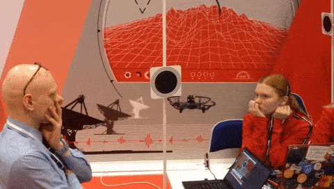

# Tello Laser Shot

Высокоурвневый интерфейс управления для дрона DJI Tello EDU, написаный для применения в качестве исходной архитектуры для решения кейса __«Разработка системы управления для автономного ударного беспилотного летательного аппарата»__ на форуме __«ПроеКТОриЯ 2019»__ в г.Ярославль 23.11.19 — 25.11.19.

## Содержание
- [Условия кейса](#условия-кейса)
- [Демонстрация решения](#демонстрация-решения)
- [Установка](#установка)
- [Описание файлов в репозитории](#описание-файлов-в-репозитории)
- [Архитектура системы управления](#архитектура-системы-управления)
	- [Структурная схема](#структурная-схема)
	- [Реализованная часть](#реализованная-часть)
	- [Особенности управления](#особенности-управления)
- [Contributing](#contributing)
- [Авторы](#авторы)


## Условия кейса

[Постановка инженерно-технической задачи кейса](https://github.com/Keleas/Tello_Laser_Shot/blob/master/case_conditions.md), которая включает в себя цели, задачи, принятые ограничения и характеристики объектов кейса.

[Техническое описание](https://docs.google.com/document/d/17kr19o82x-43bqUDP20d9jeDlM1DWrNjdxtdaQakFNs/edit?usp=sharing) модуля лазерной указки и мишени. 

[Презентация](https://docs.google.com/presentation/d/1biOTNeaPVXXxxrHvvTEWBiLqoUdYQppOPbZNus6Bpf4/edit?usp=sharing) с защиты кейса.

## Демонстрация решения



## Установка

Чтобы установить окружение с помощью __conda__: ```conda env create -f tello_drone_env.yml```

## Описание файлов в репозитории

 - __drone/djitellopy__ — [DJI Tello](https://github.com/damiafuentes/DJITelloPy) Python интерфейс с использованием официального Tello SDK.

 - __drone/main.py__ — Главный исполняемый файл, запускающий весь цикл работы дрона или отладочной системы.
 
 - __drone/base_controls.py__ — Система ручного управления всеми модулями ЛА.
 
- __drone/controller.py__ — Обвязка системы управления дрона для автопилота.

- __drone/cv_system.py__ — Система технического зрения.

- __drone/tools.py__ — Инструменты для передачи информации между модулями, инициализация вспомогательных классов.

- __drone/virtual_drone.py__ — Модуль для моделирования полета дрона.

*Код обновляется ...*

## Архитектура системы управления

Ниже представлено описание решения по разработке системы управления автономного БПЛА с полезной нагрузкой в виде системы лазерной подсветки целей (мишеней).

### Структурная схема

Комплексную систему управления БПЛА предлагается разбить на ряд подсистем (модулей):
- технического зрения;
- прицеливания;
- управления полезной нагрузкой;
- БПЛА–вождения;
- диспетчера.

Структурная схема взаимодействия всех модулей описана на рисунке ниже:


### Реализованная часть

*Изначально участникам кейса предоставляется интерфейс системы управления с инициализированными модулями и архитектурой.*

__Готово:__
- [x] __Модуль диспетчера для обмена сообщенями управления и проверки состояний с дроном__
- [x] __Модуль ручного управления с возможностью выбора типа системы управления: 1-го или 4-ех канального__
- [ ] __Модуль пересчета сигналов управления в физические величины__
- [ ] __Модуль технического зрения__
	- [x] Система прицеливания
	- [ ] Система выбора оптимальной цели
	- [x] Система определения успешного поражения
- [ ] __Модуль автопилота__
	- [ ] Система выбора оптимальной стратегии поведения
	- [x] Система построения маршрута движения
	- [ ] Система наведения
- [ ] __Модуль управления полезной нагрузкой__
	- [x] Система ведения огня
	- [ ] Система выбора оптимальной стратегии ведения огня

*Код обновляется ...*

### Особенности управления

Управление дроном происходит за счет обмена закодированных сообщений по протоколу UDP, не имющего обратной связи. Однако реализация передачи сообщений включает проверку получения обратного сигнала от дрона после выполнения заданной ему команды. 

Движение дрона осуществлятся с помощью 1-го или 4-ех канального управления. Ограничения первого типа управления состоят в невозможности обмена сообщенями во время выполнения команд движения, команды движения ограничены и строго дискретизированы по каждому направлению. Из-за этих недостатков применение такого типа управления в режиме автопилота считается невозможным.

Преимущество 4-ех канальной передачи команд управления состоит в возможности изменения направления двжиения по нескольким атомарным командам: 
- движение вперед/назад;
- поворот налево/направо;
- движение вверх/вниз;
- двжиение влево/вправо.

Все команды и допустимые значения сигналов указаны в [Tello EDU SDK](https://dl-cdn.ryzerobotics.com/downloads/Tello/Tello%20SDK%202.0%20User%20Guide.pdf).

__Команды ручного управления:__

- "w"/"s" — движение вперед/назад
- "a"/"d" — поворот налево/направо
- "q"/"e" — движение вверх/вниз
- "z"/"c" — движение влево/вправо
- "t" — взлет
- "l" — посадка
- "m" — переключение типа рученого управления
- "p" — включение/выключение автопилота
- "h" — тестовый импульс лазерной указки
- "1" - 5" — переключение передачи скорости 

## Contributing 

Правила внесения изменений в репозиторий для коллективной работы над кейсом:

1. Сделать ```fork``` репозитория

2. Склонировать на локальное устройство

3. Внести изменения

4. Сделать ```pull request```

## Авторы

__Кураторы кейса:__

[Nikita Grishin](https://github.com/Keleas)

[Daniil Makhotkin](https://github.com/Ken-chan)

__Участники кейса:__

[laptevaarina](https://github.com/laptevaarina)

*Список пополняется ...*
